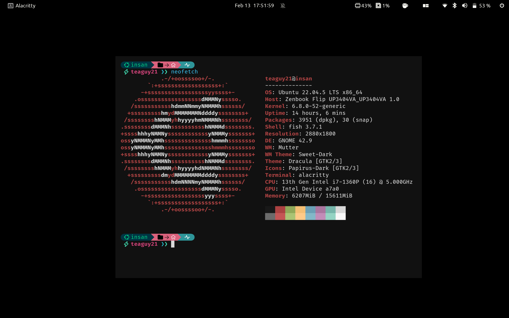

<h1> Dotfiles </h1>




#  Table of Contents
- [Table of Contents](#table-of-contents)
  - [What is dotfile?](#what-is-dotfile)
  - [Content](#content)
    - [Folders](#folders)
    - [Application](#application)
  - [Requirements](#requirements)
    - [Git](#git)
    - [Stow](#stow)
  - [Installation](#installation)


## What is dotfile?

A dotfile is a hidden configuration file that starts with a dot (.) and is used to store settings for applications and tools. They are commonly found in the home directory. 

## Content

### Folders
- .fonts
- .config 
- .themes
- .poshthemes
### Application
- alacritty
- fish
- kanata
- systemd
- neovim
- 

## Requirements

Ensure you have the following installed on your system

### Git

```
sudo apt install git
```

### Stow

```
sudo apt install stow
```

## Installation

First, check out the dotfiles repo in your $HOME directory using git

```
$ git clone git@github.com/insanansharyrasul/dotfiles.git
$ cd dotfiles
```

then use GNU stow to create symlinks

```
$ stow .
```