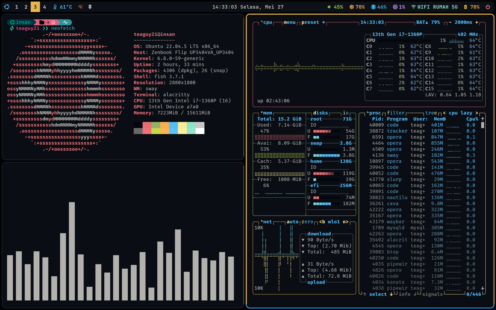

# Dotfiles

<p align="center">
  
</p>

<p align="center">
  <em>Personal configuration files for a customized Linux desktop environment</em>
</p>

---

## 📋 Table of Contents
- [Dotfiles](#dotfiles)
  - [📋 Table of Contents](#-table-of-contents)
  - [🤔 What is dotfile?](#-what-is-dotfile)
  - [📁 Content](#-content)
    - [Folders](#folders)
    - [Applications](#applications)
    - [Themes](#themes)
  - [📦 Requirements](#-requirements)
    - [Optional Dependencies](#optional-dependencies)
  - [🚀 Installation](#-installation)
  - [🎯 Usage](#-usage)
    - [Key Features](#key-features)
  - [📄 License](#-license)
  - [Credit](#credit)

## 🤔 What is dotfile?

A dotfile is a hidden configuration file that starts with a dot (.) and is used to store settings for applications and tools. They are commonly found in the home directory and allow you to customize your system's behavior and appearance.

## 📁 Content

### Folders
- **`.config`** - Application configurations  
- **`.local/share`** - User data (fonts, icons, file manager extensions)
- **`.themes`** - GTK themes
- **`.poshthemes`** - PowerShell themes

### Applications

**Window Managers & Compositors**
- **Sway** - Wayland tiling compositor
- **Hyprland** - Dynamic tiling Wayland compositor
- **i3** - X11 tiling window manager

**Status Bars & System Info**
- **Waybar** - Status bar for Wayland
- **Polybar** - Status bar for X11
- **Btop** - System monitor

**Terminals**
- **Alacritty** - GPU-accelerated terminal emulator
- **Ghostty** - Fast terminal emulator

**Application Launchers & Menus**
- **Wofi** - Wayland application launcher
- **Rofi** - X11 application launcher

**Shell & Tools**
- **Fish** - Friendly interactive shell
- **Neovim** - Text editor
- **Kanata** - Key remapping tool
- **Fusuma** - Touchpad gesture recognizer

**Wayland Utilities**
- **Mako** - Notification daemon
- **Swaylock** - Screen locker
- **Swww** - Wallpaper daemon
- **Wob** - Volume/brightness overlay bar
- **xdg-desktop-portal** - Desktop integration portal

**Other**
- **Systemd** - System services
- **GTK** - GTK 3.0 & 4.0 theming
- **Nemo** - File manager extensions

### Themes
- **Ayu dark (customized)**
- **Catppuccin**
- **Dracula**
- **Bibita Mouse Cursor**

## 📦 Requirements

Ensure you have the following dependencies installed on your system:

| Package                    | Description                       | Installation Command                                                             |
| -------------------------- | --------------------------------- | -------------------------------------------------------------------------------- |
| **Git**                    | Version control system            | `sudo apt install git`                                                           |
| **Stow**                   | Symlink farm manager              | `sudo apt install stow`                                                          |
| **Sway**                   | Wayland compositor                | `sudo apt install sway`                                                          |
| **Waybar**                 | Status bar                        | [Build manually from GitHub](https://github.com/Alexays/Waybar)                  |
| **Alacritty**              | Terminal emulator                 | `sudo apt install alacritty`                                                     |
| **Fish**                   | Shell                             | `sudo apt install fish`                                                          |
| **Neovim**                 | Text editor                       | `sudo apt install neovim`                                                        |
| **xdg-desktop-portal-wlr** | Desktop portal for screen sharing | [Build manually from GitHub](https://github.com/emersion/xdg-desktop-portal-wlr) |

### Optional Dependencies
| Package         | Description                        | Installation Command                                           |
| --------------- | ---------------------------------- | -------------------------------------------------------------- |
| **Hyprland**    | Alternative compositor             | [Build from GitHub](https://github.com/hyprwm/Hyprland)        |
| **i3**          | X11 window manager                 | `sudo apt install i3`                                          |
| **Ghostty**     | Alternative terminal               | [Download from GitHub](https://github.com/ghostty-org/ghostty) |
| **Btop**        | System monitor                     | `sudo apt install btop`                                        |
| **Wofi**        | Application launcher               | `sudo apt install wofi`                                        |
| **Rofi**        | X11 application launcher           | `sudo apt install rofi`                                        |
| **Polybar**     | X11 status bar                     | [Build from GitHub](https://github.com/polybar/polybar)        |
| **Mako**        | Notification daemon                | `sudo apt install mako-notifier`                               |
| **Swaylock**    | Screen locker                      | `sudo apt install swaylock`                                    |
| **Swww**        | Wallpaper daemon                   | [Build from GitHub](https://github.com/LGFae/swww)             |
| **Wob**         | Overlay bar                        | `sudo apt install wob`                                         |
| **Fusuma**      | Touchpad gestures                  | `sudo gem install fusuma`                                      |
| **Kanata**      | Key remapping                      | [Download from GitHub](https://github.com/jtroo/kanata)        |
| **kde-connect** | Multiplatform device communication | [Install from source](https://github.com/KDE/kdeconnect-kde)   |

## 🚀 Installation

1. **Clone the repository** to your home directory:
   ```fish
   git clone git@github.com:insanansharyrasul/dotfiles.git ~/.dotfiles
   cd ~/.dotfiles
   ```

2. **Create symlinks** using GNU Stow:
   ```fish
   stow .
   ```

3. **Reload your configuration** or restart your session to apply changes.

## 🎯 Usage

After installation, your dotfiles will be symlinked to their appropriate locations. You can:

- **Update configurations** by editing files in the `~/.dotfiles` directory
- **Add new configs** by placing them in the appropriate folder structure
- **Sync changes** by running `git pull` in the dotfiles directory

### Key Features
- 🎨 **Consistent theming** with Ayu Dark and Catppuccin across all applications
- ⚡ **Multiple WM/compositor configs** - Sway, Hyprland, and i3 ready to use
- 🔧 **Custom status bars** - Waybar for Wayland, Polybar for X11
- 📝 **Dual terminal setup** - Alacritty & Ghostty with matching themes
- 🚀 **Wayland-first workflow** with Mako, Wofi, Swaylock, and Swww
- 🎛️ **Enhanced input handling** - Kanata key remapping and Fusuma gestures
- 🖱️ **GTK theming** for consistent application appearance
- 📦 **Systemd services** for automatic startup configurations

## 📄 License

This project is licensed under the GPL-3.0 license - see the [LICENSE](LICENSE) file for details.


## Credit 
I also used other resources for my dotfiles:
1. [Ayu-dark theme, by K4zoku](https://github.com/K4zoku/dotfiles/tree/a486fb6d612db309e0dfc9123fb2ffcf9213db21)

---

<p align="center">
  <em>Happy customizing! 🏠✨</em>
</p>
